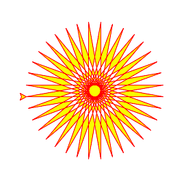

# Let the turtles draw for us :laughing:

## SECTION 0: Let's start...

- If you are participating in the lightning lab, you should have **already downloaded some kind of Python IDE** such as [IDLE](https://www.python.org/downloads/). *If you have not, you can use online compilers such as [Repl.it](https://repl.it/languages/python_turtle) but do note (after some ~~intensive~~ testing), you might face some compile issues while using online compilers and hence will have problems with running certain codes especially from SECTION 5 Onwards*

---

## SECTION 1: Customising your turtle...

- By default when you installed python, the turtle library is already installed but you would import the turtle library into your code such that you can use it later on:
```
import turtle
from turtle import *
```
- Now, we need to create the turtle object or simply the "turtle" using the .Turtle() method from the turtle library:
```
t = turtle.Turtle() #note: t is just a random variable, you can replace it with anything you wish (except for turtle)
```
- If you want to create multiple "turtles", simply call the `.Turtle()` method as many times as you need but assign it to a different variable each time
```
#code below creates 2 "turtles"
t = turtle.Turtle()
k = turtle.Turtle()
```
- But if you click run now (on your IDE or online compiler), you will realise that you get an arrowhead instead of a turtle?? That's because by default the shape of the "turtle" is an arrowhead. Let's change it to a turtle using the `.shape()` method of the turtle object :laughing::
```
t.shape("turtle")
#note: since .shape() is a method of the turtle object you created, you need to prepend the variable which you assigned the turtle object to.
#you can also try it out with these shapes “arrow”, “turtle”, “circle”, “square”, “triangle”, “classic”
```
- Let's now change the color of your turtle (and whatever it draws) using the `.color()` method of the turtle object:
```
t.color("red") #change the value in the brackets to the color of your choosing
```
- Finally, let's change the size of the line which our "turtle" draws using the `.pensize(x)` method of the turtle object. The value of x will determine the thickness of the line:
```
t.pensize(5) #the larger the number in the bracket, the thicker the line
```
---

## SECTION 2: Moving your turtle...

- Now, let's move our "turtle" forward/backwards. If you look closely, by default, the turtle is facing in the rightward direction. Hence, we can use the `.forward(x)` and `.backward(x)` method to move forward and backward (respectively) in the direction which the turtle is facing. The value of x specify the distance which the turtle moves
```
t.forward(100) #moves the turtle forward by 100 pixels therefore drawing a line of 100 pixels
t.backward(200) #moves the turtle back by 200 pixels therefore drawing a line of 200 pixels
```
- Now, how about if we want to turn our turtle (relative to the direction which the turtle is facing), we can use the `.left(x)` and `.right(x)` method to turn our turtle anticlockwise and clockwise (respectively). The value of x specify the angle in which the turtle turns
```
t.left(90) #turns anticlockwise by 90 degrees
t.right(123) #turns clockwise by 123 degrees
```
- What if we want to move our turtle around without it drawing any lines? We can use the `.penup()` method to stop our turtle from drawing until we call the `.pendown()` method, after which our turtle would start drawing again.
```
t.penup() #turtle stops drawing
t.forward(100) #turtle doesn't draw line
t.pendown() #turtle starts drawing again
t.forward(100) #turtle draws line
```
- What if we want our turtle to move faster (for that dramatic wow effect!) We can use the `.speed(x)` method to control the speed in which our turtle moves. The larger x is, the faster our turtle moves. Note: `.speed(0)` is an exception as it makes the turtle "teleport":
```
t.speed(1) #moves slower than t.speed(100)
```
- What if I don't know the absolute number of pixels to move but want to move to a certain position? We can use the `.setpos(x,y)` method where the value of x is the x-coordinate and the value of y is the y-coordinate that the turtle would move to. (`Note: The centre of the screen is at the point of (0,0)`) While moving, unless the `.penup()` method was used, the turtle would still draw a straight line from its current position to the intended position.
```
t.setpos(-100, -200) #turtle moves in a straight line from the current position to the position of (-100,-200)
```
- How about if we want to draw a circle? Well, one simple way to do so is to use the `.circle(x)` method. The value of x is the size of the radius of the circle drawn:
```
t.circle(7) #turtle draws a circle of radius size of 7 pixels
```
---

## SECTION 3: lazy turtle filling in colors:

- After drawing circles (or other shapes) is there a way for me to color the shape? We could do it with the following code/steps:
  * Set a second parameter in the `.color()` method to set the fill color of the shapes. The first parameter is the color of the outline/line, and the second parameter is the fill color
  * Use the `.begin_fill()` method before any of the other methods/functions you are going to use to draw the shapes (that you want to fill)
  * DRAW... the shape
  * Use the `.end_fill()` method after drawing the shape you would like to fill (this would fill in the shape that you drawn)
```
t.color("red", "blue") #this sets the turtle's outline/line color to red and the fill color to blue
t.begin_fill()
t.circle(9) #draws a circle of radius 9
t.end_fill() #fills in the circle that was drawn with blue color (we set the color above)
```
---

## SECTION 4: Turtles In Loops:

- The turtle library is just one of the libraries of python and of course can be used with loops to make your life a whole lot easier. Below is an example on how to draw a square with for-loop:
```
#turtle draws a square
for i in range(4): #doing the following 2 lines of code 4 times (aka 4 sides)
  t.forward(100) #draws a line of length 100 pixels
  t.left(90) #turns 90 degrees
```
- Another example (found on the turtle python website) In the example below, the `.pos()` method, returns the current position of the turtle:
```
import turtle #import turtle library
t = turtle.Turtle() #creates the turtle object
t.color('red', 'yellow') #sets the outline color to red and fill color to yellow
t.begin_fill() #"start" the filling process
while True: #looping...
    t.forward(200) #turtle moves 200 pixels forward
    t.left(170) #turtle turns anticlockwise by 170 degrees
    if abs(t.pos()) < 1: #a condition to be fulfilled to break out (if not a infinite loop will occur)
      break
t.end_fill() #"end" the filling process
```
Upon executing the code above, you should see



---

## SECTION 5: Turtle's Key Events

- What if I want to control where my turtle moves using my keyboard? We could use turtle's key events to control our turtle from our keyboard and mouse! The following code allows you to move your turtle using the arrow keys and randomly change colors with a left click with a mouse:
```
import turtle #importing turtle library
import random #importing the random library (we would be using it later)
from turtle import *
t = turtle.Turtle() #creates the turtle object
colors = ["black", "blue", "yellow", "green"] #an array of colors to choose from, to change our turtle color to.
def up(): #create a function called up which makes turtle point upwards and move 100 pixels forward
  t.setheading(90) #90 is north
  t.forward(100)

def down(): #create a function called up which makes turtle point downwards and move 100 pixels forward
  t.setheading(270) #270 is south
  t.forward(100)


def left(): #create a function called up which makes turtle point left and move 100 pixels forward
  t.setheading(180) #180 is left
  t.forward(100)

def right(): #create a function called up which makes turtle point right and move 100 pixels forward
  t.setheading(0) #0 is right
  t.forward(100)

def clickleft(x,y): #creates a function which changes our turtle's color to a random color within the colors array
  t.color(random.choice(colors))

turtle.listen() #listens to input from user from mouse, keyboard, etc

turtle.onscreenclick(clickleft, 1) #calls the clickleft() function when the left mouse is clicked (anywhere on the screen except for the turtle itself)


turtle.onkey(up, "Up") #listens to the "Up" key and executes the up() function
turtle.onkey(down, "Down") #listens to the "Down" key and executes the down() function
turtle.onkey(left, "Left") #listens to the "Left" key and executes the left() function
turtle.onkey(right, "Right") #listens to the "Right" key and executes the right() function

turtle.mainloop() #looping the code above such that your code does not exit immediately
```
- Notes/ TLDR:
  * The `.setheading(x)` method turns the turtle to the specified direction. The value of x is 0 when facing right and increases anticlockwise
  * Notice that the `clickleft(x,y)` function is defined with 2 parameters even though we did not use either parameters. This is because, we would be using the `clickleft(x,y)` function with the `.onscreenclick(function, int)` which returns 2 values (x and y coordinates of where you clicked on the screen), hence we need to accept 2 values even though we are not using the 2 values
  * The `.onscreenclick()` method calls the function in the first parameter, when a mouse click event is detected. The number in the second parameter is:
      * 1 when you want the method to listen to left mouse button clicks
      * 2 when you want the method to listen to middle mouse button clicks
      * 3 when you want the method to listen to right mouse button clicks
  * The `.onkey()` method calls the function in the first parameter, when a keyboard press event is detected. The string/character in the second parameter is:
      * "Up" when you want the method to listen to the up arrow key being clicked
      * "a" when you want the method to listen to the "a" key being clicked
      * "A" when you want the method to listen to the "A" key being clicked
      * etc....
  * The `.listen()` method allows the turtle to listen to the input from the user
  * The `.mainloop()` method loops the codes above it to prevent your code from exiting immediately
  
 ---
 
 ## Additional Links...

- [Beginner's Guide to turtle.py](https://realpython.com/beginners-guide-python-turtle/)
- [Drawing with Mouse in turtle.py](https://www.youtube.com/watch?v=HRKQlEfEMCA)
- [Event-driven programming with turtle.py](https://artofproblemsolving.com/assets/pythonbook/events.html)
